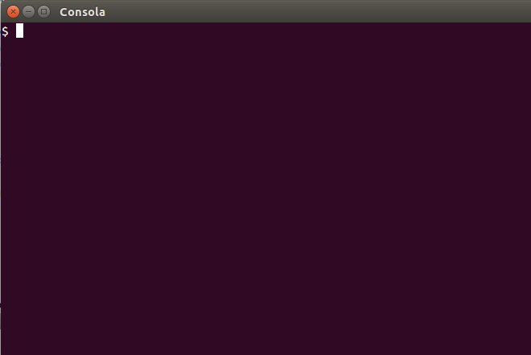

# Tutorial Shell Script para o Grupy-SP Agosto 2016

Este tutorial foi apresentado no Grupy-SP em Agosto de 2016.

Todo material também está disponível em http://grandeportal.github.io/

http://grandeportal.github.io/shell/2016/shell-script1/

http://grandeportal.github.io/shell/2016/shell-script2/

http://grandeportal.github.io/shell/2016/shell-script3/

http://grandeportal.github.io/shell/2016/shell-script-python/

# Shell Script 1 - O Básico

Você já leu o [Papo de Botequim][4] por Julio Cezar Neves? Se não, eu sugiro que leia, pois é um excelente material sobre [Shell Script][5]. Lá ele explica, dentre outras coisas, a diferença entre Bash e Shell. Bom, aqui eu vou mostrar apenas os comandos que eu considero mais relevantes, mas não deixe de ler o [Papo de Botequim][4].

## O que é Bash e Shell Script?

[Bash][2] é o **interpretador** e [Shell Script][7] é a linguagem.

## A caixa de ferramentas do shelleiro

O [Canivete Suíço do Shell (Bash)][0] do [Aurélio Marinho Jargas][1] é o guia de referência de quem quer aprender Shell Script. E por isso vou reproduzir aqui os comandos que ele menciona em "[A caixa de ferramentas do shelleiro][3]".

| Comando   | Função                | Opções úteis                             |
|-----------|-----------------------|------------------------------------------|
| cat       | Mostra arquivo        | -n, -s                                   |
| cut       | Extrai campo          | -d -f, -c                                |
| date      | Mostra data           | -d, +'...'                               |
| diff      | Compara arquivos      | -u, -Nr, -i, -w                          |
| echo      | Mostra texto          | -e, -n                                   |
| find      | Encontra arquivos     | -name, -iname, -type f, -exec, -or       |
| fmt       | Formata parágrafo     | -w, -u                                   |
| grep      | Encontra texto        | -i, -v, -r, -qs, -n, -l, -w -x, -A -B -C |
| head      | Mostra início         | -n, -c                                   |
| od        | Mostra caracteres     | -a, -c, -o, -x                           |
| paste     | Paraleliza arquivos   | -d, -s                                   |
| printf    | Mostra texto          | nenhuma                                  |
| rev       | Inverte texto         | nenhuma                                  |
| pwd       | Mostra o caminho do diretório atual |                            |
| sed       | Edita texto           | -n, -f, s/isso/aquilo/, p, d, q, N       |
| seq       | Conta números         | -s, -f                                   |
| sort      | Ordena texto          | -n, -f, -r, -k -t, -o                    |
| tac       | Inverte arquivo       | nenhuma                                  |
| tail      | Mostra final          | -n, -c, -f                               |
| tee       | Arquiva fluxo         | -a                                       |
| tr        | Transforma texto      | -d, -s, A-Z a-z                          |
| top       | Mostra os processos dinamicamente |                              |
| uniq      | Remove duplicatas     | -i, -d, -u                               |
| wc        | Conta letras          | -c, -w, -l, -L                           |
| which     | Mostra a localização de um arquivo executável |                  |
| who       | Mostra que está conectado |                                      |
| whoami    | Mostra o nome do usuário logado |                                |
| xargs     | Gerencia argumentos   | -n, -i                                   |


## O Básico

Antes de sair explorando "A caixa de ferramentas do shelleiro", vamos começar do começo.

Para abrir o terminal você pode pressionar Ctrl+Alt+T.


O `$` é o prompt do comando, ou seja, a partir deste símbolo você pode digitar seus comandos.

Se você já leu [alterando o prompt terminal][6] você deve ter visto este prompt:

```bash
rg3915@acer:~/gh/grandeportal$ 
```

onde

```bash
usuario@maquina:caminho$
```

E `~` é a pasta principal, a pasta `home` do usuário atual.

Esta é a configuração padrão do prompt de comando do terminal, mas se quiser, você pode mudar digitando, por exemplo.

```bash
PS1="$ "
```




> Para todos os comandos digite `--help`.

```bash
$ <comando> --help
```

## Arquivos e Diretórios

```bash
$ pwd
```

Mostra o nome e caminho do diretório atual.

### Criando pastas

```bash
$ mkdir pastaprincipal
$ mkdir pasta1 pasta2 pasta3
$ mkdir -p novapasta/subpasta
```

O argumento `-p` cria os diretórios pais à medida que forem necessários sem gerar erro. Ou seja, para criar *subpasta* primeiro ele cria *novapasta*.

### Removendo pastas

```bash
$ rmdir pastaprincipal
```

Remove o diretório se estiver vazio.

### Criando arquivos vazios

```bash
$ touch arquivoprincipal.txt
$ touch arquivo1.txt arquivo2.txt arquivo3.txt
$ touch templates/{base.html,index.html,nav.html}
```

**Obs**: Note que neste exemplo devemos criar a pasta *templates* antes.

### Listando os arquivos

```bash
$ ls
$ ls -l
$ ls -la
```

```bash
$ ls
arquivo1.txt  arquivo2.txt  arquivo3.txt  arquivoprincipal.txt
```

`-l` esta opção usa o formato de listagem longa.

```bash
$ ls -l
total 16
-rw-rw-r-- 1 rg3915 rg3915 0 Mar  5 10:57 arquivo1.txt
-rw-rw-r-- 1 rg3915 rg3915 0 Mar  5 10:57 arquivo2.txt
-rw-rw-r-- 1 rg3915 rg3915 0 Mar  5 10:57 arquivo3.txt
-rw-rw-r-- 1 rg3915 rg3915 0 Mar  5 10:57 arquivoprincipal.txt
```

`-a` mostra arquivos ocultos, que começam com `.`

```bash
$ ls -la
total 32
drwxrwxr-x 2 rg3915 rg3915 4096 Mar  5 10:57 .
drwxrwxr-x 3 rg3915 rg3915 4096 Mar  5 10:57 ..
-rw-rw-r-- 1 rg3915 rg3915    0 Mar  5 10:57 .env
-rw-rw-r-- 1 rg3915 rg3915    0 Mar  5 10:57 arquivo1.txt
-rw-rw-r-- 1 rg3915 rg3915    0 Mar  5 10:57 arquivo2.txt
-rw-rw-r-- 1 rg3915 rg3915    0 Mar  5 10:57 arquivo3.txt
-rw-rw-r-- 1 rg3915 rg3915    0 Mar  5 10:57 arquivoprincipal.txt
```

No exemplo, `.env` é um arquivo oculto.

Experimente

```bash
$ ls -lh
```

### Visualizando os arquivos numa árvore

```bash
$ sudo apt-get install tree
$ tree templates
$ tree --help
```


### Excluindo arquivos e pastas

Depois de ler os comandos a seguir você vai entender o que o [maluco fez quando excluiu todos os dados da empresa](http://www.tecmundo.com.br/programacao/103701-cara-cade-firma-rapaz-deleta-empresa-linha-codigo-errada.htm).

```bash
$ rm arquivoprincipal.txt
$ rm -i arquivoprincipal.txt
$ rm -f arquivoprincipal.txt
$ rm -rf novapasta
$ rm arquivo*.txt
$ rm *.txt
```

> Cuidado: os comandos a seguir são extremamente perigosos!!!

```bash
$ rm *
$ rm -rf *
```

**Cuidado**: O primeiro comando exclui **todos** os arquivos da pasta atual. O segundo exclui **todos recursivamente** e com **force** ativado, ou seja, exclui arquivos não-vazios sem perguntar.

Experimente

```bash
$ rm -rf \*
```

Este comando **anula** o efeito excluir tudo.

Leia mais em [cuidado com comandos perigosos do shell](http://grandeportal.github.io/shell/2016/cuidado-com-comandos-perigosos-do-shell/).


### Copiando arquivos

```bash
cp arquivo.txt arquivo_bkp.txt
cp arquivo.txt /subpasta
cp * /subpasta
cp ~/Documentos .
cp -R ~/Documentos backup/
```

### Movendo arquivos

Move ou renomeia arquivos e diretórios. Semelhante ao `cp`, mas o arquivo de origem é apagado.

```bash
$ mv arquivo.txt backup/
$ mv arquivo.txt novo_nome.txt
```

### Criando links

O comando a seguir cria um link simbólico, o que comumente chamamos de atalho.

```bash
$ ln -s ~/Imagens/ img
```

Digitando `cd img` entramos na pasta `~/Imagens/` através do atalho.


# Redirecionamento de Comandos

## `>`

Redireciona a saída de um comando para outro arquivo. Se o arquivo existir será sobrescrito.


```bash
$ ls -la > dir.txt
```

## `>>`

Redireciona a saída, mas acrescentando os dados ao final do arquivo, sem sobrescrever o arquivo.

```bash
ls /etc/passwd >> dir.txt
```

## `<`

Redireciona a entrada.

```bash
wc -l < arquivo
```

Conta o número de linhas não vazias do arquivo.

Experimente:

```bash
cat << EOF > arquivo.txt
Z
X
C
B
A
EOF
```

Depois

```bash
cat arquivo.txt
```

Depois

```bash
sort < arquivo.txt
```

## Pipes

Pipes ( `|` barra vertical) - permite que um programa utilize como entrada a saída de outro programa.

```bash
$ ls | wc -l
```

```bash
$ echo Existem `who | wc -l` usuarios conectados
```

```bash
$ ls -a | sort -r
```

Faz com que o comando `sort` receba como entrada a saída produzida pelo comando `ls`. Neste exemplo o `sort` ordena na ordem reversa.

```bash
$ cat /etc/passwd | wc -l > lista.txt
```

Grava no arquivo `lista.txt` o número de linhas do arquivo `passwd`.


# Grep

Pesquisando em um arquivo específico.

```bash
$ grep force_color ~/.bashrc
```

Resultado:

```bash
force_color_prompt=yes
if [ -n "$force_color_prompt" ]; then
unset color_prompt force_color_prompt
```

Pesquisando em todos os arquivos do tipo `txt`.

```bash
$ grep regis *.txt
```

Pesquisando na saída de um comando

```bash
$ who | grep rg3915
```

```bash
$ ps aux | grep python
```

```bash
$ curl http://www.meetup.com/pt-BR/Grupy-SP/events/232869373/ | grep Regis
```

```bash
$ curl http://www.meetup.com/pt-BR/Grupy-SP/events/232869373/ | grep -c Python
```

```bash
$ grep -i
$ grep --ignore-case
```

```bash
$ grep -r
$ grep --recursive
```

```bash
$ grep -c
$ grep --count
```


### echo

```bash
echo "Hello World"
```

Experimente

```bash
echo {2..10}
echo {a..Z}
```

```bash
echo azul{' claro',' escuro'}
```

#### Tabulação

```bash
printf "Um\tDois"
```

#### Quebra de linha

```bash
printf "Um\nDois"
```


# Shell Script 2 - Estruturas de Controle

Não vou explicar muito, apenas digite e veja o que acontece ;)

```bash
seq 10
```

```bash
seq 2 2 10
```

```bash
mkdir pasta; touch pasta/arquivo.txt; cd pasta; ls
```

```bash
if grep mm /etc/passwd; then echo 'ok'; else echo 'não'; fi
```

```bash
if who | grep regis; then echo regis está logado; else echo regis não está logado; fi
```

A seguir, usaremos o comando `test` para verificar se um arquivo existe.

```bash
# Verifica se o arquivo existe
if test -e $1; then cat $1; else echo Arquivo não encontrado; fi
```

Repare, no exemplo a seguir, que podemos substituir o comando `test` por um par de colchetes `[ ]`.

```bash
# Verifica se uma pasta existe
if [ ! -d pasta42 ]; then echo 'Pasta não existe'; else echo 'Pasta já existe, veja:'; ls; fi
```

```bash
n1=1
n2=2
if [ $n1 -eq $n2 ]
then
    echo "n1 é igual a n2"
else
    echo "n1 é diferente de n2"
fi
```

```bash
n1=1
n2=2
if [ $n1 -ne $n2 ]
then
    echo "n1 é diferente de n2"
else
    echo "n1 é igual a n2"
fi
```


```bash
c=0; while [[ c -le 10 ]]; do echo "$c"; (( c++ )); sleep 0.5; done
```

### Fibonacci Series

```bash
#!/bin/bash
c=0
a=1
b=1
read -p "Enter limit of fibonacci Series:" n
echo -n "$a "
echo -n "$b "
#Fibonacci series logic
while((c<n))
do
    c=$((a+b))
    echo -n "$c "
    a=$b
    b=$c
done
echo -e "\n"
```

`$((a+b))` significa uma expansão aritmética.

## For

```bash
for i in $(seq 10); do echo "$i"; sleep 0.5; done
```


```bash
itens="Um Dois Três Quatro Cinco"
for item in $itens; do echo $item; done
```


```bash
for ((i=1; i<=9; i++))
do
    echo -n "$i "
done
echo ""
```

### Executando uma ação n vezes

```bash
for i in $(seq 10); do touch file$i.txt; done
```


## Entrada de dados

```bash
read -p "Digite seu nome: " nome; echo "Bem-vindo $nome"
```


## Função

```bash
#!/bin/bash

soma(){
    a=$1
    b=$2
    echo `expr $a + $b`
}

read -p 'Digite um número: ' x
read -p 'Digite outro número: ' y
soma $x $y
```

## Criando vários arquivos com um texto aleatório

```bash
$ sudo apt-get install gpw
for i in $(seq 1 10); do echo "text$i" > file$i.txt; gpw 7 10 >> file$i.txt; done
```

## Inserindo o conteúdo de vários arquivos dentro de um único arquivo

```bash
for i in $(seq 1 10); do cat file$i.txt >> finalfile.txt; done
```


## Juntando vários arquivos em um só

```bash
echo "Um" > um.txt
echo "Dois" > dois.txt
arqs="um.txt dois.txt"
for i in $arqs; do cat $i >> joinedfile.txt; done
```

```bash
arqs="um.txt dois.txt"
cat $arqs > joinedfile.txt
cat joinedfile.txt
```


## Separando um arquivo em vários linha a linha

```bash
printf '%s\n' 'Um' 'Dois' 'Três' 'Quatro' 'Cinco' > file.txt
# ou
itens="Um Dois Três Quatro Cinco"; for item in $itens; do echo $item >> file.txt; done

# Separando
while read line; do line=${line}; echo "${line}" > "${line}"; done < file.txt

# Lendo
while read line; do cat "${line}"; done < file.txt
```


## Separando um arquivo em vários linha a linha com a seguinte regra...

```bash
SECRET_KEY=apqoie38728cmx8s67xs
ALLOW_HOST=127.0.0.1
```

```bash
$ cat SECRET_KEY
apqoie38728cmx8s67xs
$ cat ALLOW_HOST
127.0.0.1
```

http://bit.ly/2awZo0d

## Substituindo texto no arquivo sem abri-lo

```bash
echo "Eu gosto de Java." > linguagens.txt
cat linguagens.txt
sed -i "s/Java/Python/g" linguagens.txt
cat linguagens.txt
```


## Renomeando todos os arquivos numa sequência numérica

```bash
# Criando 30 arquivos com nomes aleatórios
for i in $(seq 1 30); do var=`gpw 1 10`; touch $var.txt; done
# Renomenando tudo numericamente
c=0; j=1; for i in *; do ((c++)); if (($c <= 9)); then mv $i 0$j\_$i; else mv $i $j\_$i; fi; ((j++)); done
```


## Numerar Linhas

```bash
sed -n "/pattern/{=;p}" arquivo
```

```bash
sed -n "/*/{=;p}" arquivo.txt | sed "{N;s/\n/ /}" > arquivo2.txt
```

```bash
cat -n arquivo.txt > arquivo2.txt
```

```bash
awk '{printf("%5d: %s\n", NR,$0)}' arquivo.txt > arquivo2.txt
```


## Alterando o prompt

```bash
PS1="$ "
```

```bash
PS1="\e[1;34m/\W\e[00m$ "
```

http://grandeportal.github.io/terminal/2016/alterando-o-prompt-do-terminal/


## Renomeando comandos

```bash
vim ~/.bash_profile
```

```bash
alias rm='rm -i'
```

```bash
vim ~/.bashrc
```

```bash
source ~/.bash_profile
```

http://grandeportal.github.io/terminal,%20alias/2016/renomeando-comandos/


## Shell Script to print Pyramid of Numbers

```bash
#!/bin/bash

#Taking input
read -p "Enter Number:" number

#Outer loop for printing number of rows in pyramid
for((row=1;row<=number;row++))
do

    #Loop for printing required spaces
    for((spaces=row;spaces<=number;spaces++))
    do
        echo -ne " "
    done

    #Loop for printing 1st part
    for((j=1;j<=row;j++))
    do
        echo -ne "$j"
    done

    #Loop for printing 2nd part
    for((l=(row-1);l>=1;l--))
    do
        echo -ne "$l"
    done

    #echo for printing new line
    echo 
done
```

http://technicalworldforyou.blogspot.com.br/2014/01/shell-script-to-print-pyramid-of-numbers.html


## Shell Script e Python

```python
import subprocess
subprocess.call("clear", shell=True)
subprocess.call("echo 'Usando Shell Script e Python'", shell=True)
subprocess.call("ls -l", shell=True)
```

https://docs.python.org/3/library/subprocess.html

http://www.jperla.com/blog/post/a-clean-python-shell-script


## Funny

```bash
sl
```

```bash
cmatrix
```

```bash
figlet Grupy-SP
```

```bash
sudo apt-get install libaa-bin
aafire
```

```bash
sudo apt-get install bsdgames
worm
```

Leia mais em

http://technicalworldforyou.blogspot.com.br/

http://rberaldo.com.br/curso-de-shell-script-modulo-1-scripts-shell-estruturas/

http://aurelio.net/shell/canivete/

https://pt.wikipedia.org/wiki/Bash

http://aurelio.net/shell/canivete/#ferramentas

https://jneves.wordpress.com/2008/03/05/papo-de-botequim-parte-1/

http://wiki.softwarelivre.org/TWikiBar/WebHome

http://grandeportal.github.io/

http://grandeportal.github.io/shell/2016/shell-script1/

http://grandeportal.github.io/shell/2016/shell-script2/

http://grandeportal.github.io/shell/2016/shell-script3/

http://grandeportal.github.io/shell/2016/shell-script-python/


[0]: http://aurelio.net/shell/canivete/
[1]: http://aurelio.net/
[2]: https://pt.wikipedia.org/wiki/Bash
[3]: http://aurelio.net/shell/canivete/#ferramentas
[4]: https://jneves.wordpress.com/2008/03/05/papo-de-botequim-parte-1/
[5]: http://wiki.softwarelivre.org/TWikiBar/WebHome
[6]: http://grandeportal.github.io/terminal/2016/alterando-o-prompt-do-terminal/
[7]: https://pt.wikipedia.org/wiki/Shell_script